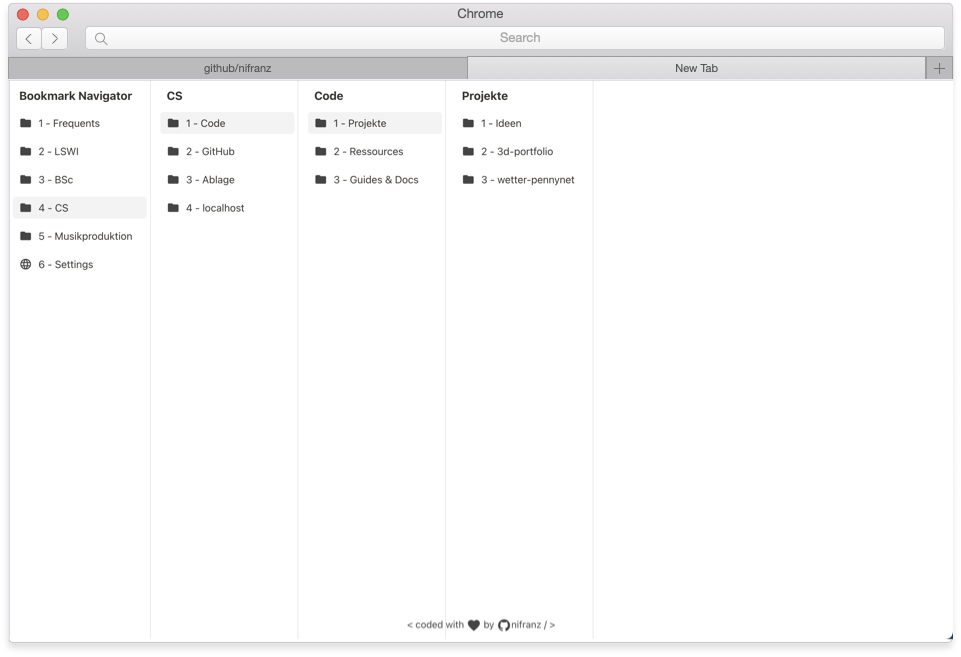

# Bookmark Navigator

A simple Chrome New Tab Page that lets you navigate and open your bookmarks with your number keys!

## Running this extension

1. Clone this repository.
2. Load this directory in Chrome as an [unpacked extension](https://developer.chrome.com/docs/extensions/mv3/getstarted/development-basics/#load-unpacked).
3. Pin the extension to the taskbar and open up the popup by clicking the action button.
4. Experiment with adding and removing bookmarks using the buttons within the popup.
